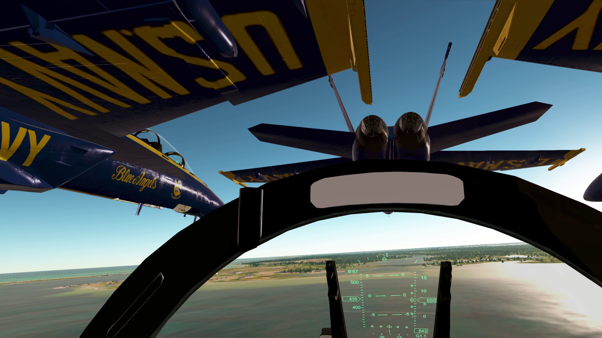
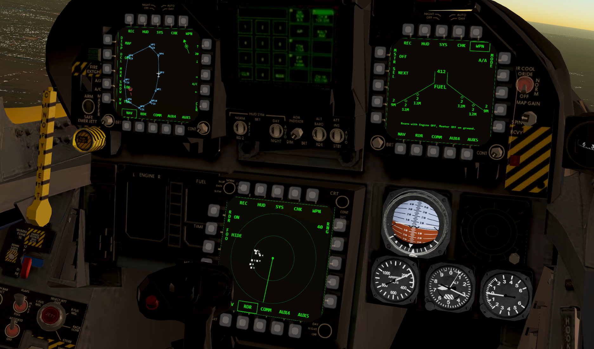
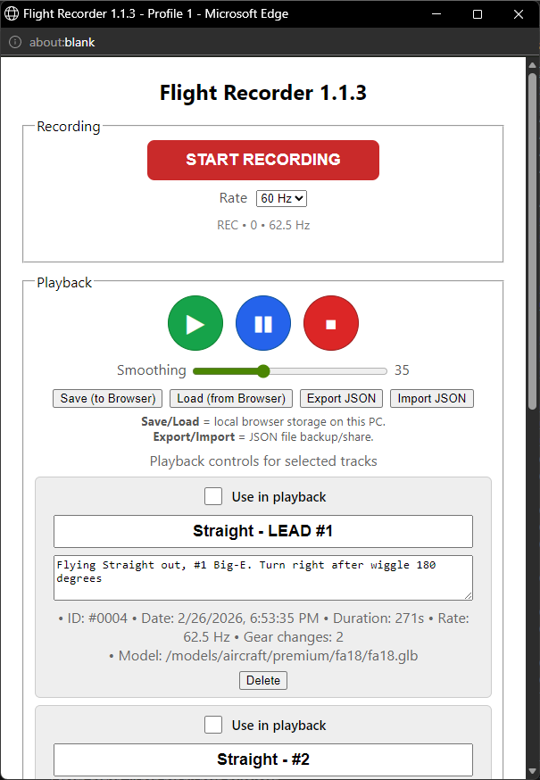

# GeoFS Blue Angels
Welcome to the main GeoFS Blue Angels hub. This space provides everything for this group to operate. Note that we're not affiliated in any way with the real Blue Angels.

## Joining us
We welcome pilots who are able to fly in close formation. 
Add `net_zero2030` on Discord to apply. You'll be first added as a trainee, so you can train with us.
After successfully completing the pilot checkride, in which you demonstrate that your skills are up to our standard, you will transition to our display team.

# Manual
Our manual contains our way of working and procedures. It also details how to set up Geo-FS, so you can use our liveries and scripts.

[Read it here](https://raw.githubusercontent.com/ArjanKw/GeoFS-BlueAngels/refs/heads/main/Manual/Geo-FS%20Blue%20Angels%20Manual.pdf)

[Tips on formation flying](https://raw.githubusercontent.com/ArjanKw/GeoFS-BlueAngels/refs/heads/main/Manual/FormationFlying.pdf)

# Blue Angels livery
This allows the GeoFS Blue Angels team to use their Blue Angels livery, and see it in multiplayer, using the Livery Selector.
In the Livery Selector, add this Virtual Airline URL: `https://raw.githubusercontent.com/ArjanKw/GeoFS-BlueAngels/refs/heads/main/airline.json`

Now you can select the Blue Angels livery of your choice:

## Create your own livery.
Install Inkscape and open `Blue-Angels-Texture-Inkscape-Template.svg`. With this file you can change the callsign next to the canopy, and choose a number on the tail. Export it to png.

If you want to have the livery available in the livery selector:
1) Edit airline.json and add the livery.
2) Place the png in this folder.
3) Push to the main branch.

If you don't have rights for this, create an Issue or Pull Request with the requested changes.

# Scripts
These scripts are used by the GeoFS Blue Angels to improve their flying. Install the browser extension Tampermonkey to manage these scripts easily.

Developer documentation for the scripts [can be found here](Scripts/README.md).

## F-18 / F-15 Add-on
This script improves the F-18 in many ways. It add's a totally reworked F-18 HUD with a FPV and AoA bracket, adds MFD's with a radar, HSI, Communication and weapon displays, extra views in and outside the cockpit, the option to change your seat height and more. In the HUD page you can now switch HUD mode between `F-18` and `DEFAULT`.

## Stable (F-18)
Installation (v1.7.0 stable): [geo-fs-f18-mod.js](https://raw.githubusercontent.com/ArjanKw/GeoFS-BlueAngels/refs/heads/main/Scripts/geo-fs-f18-mod.js).

## F-18 v2.0.0 beta
- [Add this readable script](https://raw.githubusercontent.com/ArjanKw/GeoFS-BlueAngels/refs/heads/main/build/geo-fs-f18-addon.user.full.js) to Tampermonkey
- Or [add this minified version](https://raw.githubusercontent.com/ArjanKw/GeoFS-BlueAngels/refs/heads/main/build/geo-fs-f18-addon.user.min.js).

## F-15 v2.0.0 beta
- [Add this script](https://raw.githubusercontent.com/ArjanKw/GeoFS-BlueAngels/refs/heads/main/build/geo-fs-f15-addon.user.full.js) to Tampermonkey
- Or [add this minified version](https://raw.githubusercontent.com/ArjanKw/GeoFS-BlueAngels/refs/heads/main/build/geo-fs-f15-addon.user.min.js).

## Flight recorder
This addon allows you to record your flight and play it back while recording a new flight. This way you can record formation flights and practise formation flying.

Installation: [add this script](https://raw.githubusercontent.com/ArjanKw/GeoFS-BlueAngels/refs/heads/main/Scripts/geo-fs-flight-recorder.js) to Tampermonkey, or execute it in Developer Console.

Use it by clicking the REC button in the bottom left, opening this panel:

## Multiplayer info
With this script you see the speed, distance and aircraft type for each aircraft, so you can intercept them easily. Press the 'L' key to see/hide labels. It now also shows you the closing speed, handy for an intercept!
As GeoFS isn't equiped with a radar, we use this as an alternative.

Installation: [add this script](https://raw.githubusercontent.com/ArjanKw/GeoFS-BlueAngels/refs/heads/main/Scripts/multiplayer-info.js) to Tampermonkey, or execute it in Developer Console.

## Chat fix
There is a bug in GeoFS that prevents the key 'T' to open the chat input. Fixing this helps to quickly communicate without having to rely on your mouse.
This script [is created by Zeta](https://github.com/ZetaPossibly/GeoFS-Chat-Fix), all credits go to him.

Installation: [add this script](https://raw.githubusercontent.com/ZetaPossibly/GeoFS-Chat-Fix/refs/heads/main/fix_chat.js) to Tampermonkey, or execute it in Developer Console.

## Flight info
With this script your speed (True airspeed, Ground speed and Mach number), altitude (Flight Level, Altitude in feet and Climbrate), Angle of Attack, Gear and Flap position are displayed in the bottom. It will also warn you for a gear up landing, a stall or flying with engine off. If you have the Engine Power Boost script installed, it will also display your engine mode.

This script can be useful when you're flying the landing pattern and you're circling in to land, looking at the runway. In reality the Blue Angels pilots see their speeds in their helmet mounted display, so they can both look at the runway and watch their speed.

Installation: [add this script](https://raw.githubusercontent.com/ArjanKw/GeoFS-BlueAngels/refs/heads/main/Scripts/geo-fs-flight-info-display.js) to Tampermonkey, or execute it in Developer Console.

Press the letter 'U' or click on the Flight Info to change the display mode, from 1 to 5. The higher the number, the more information is being shown.

This is shown when Flight Info is off:

Mode 1 shows speed (True Air Speed), altitude in feet + flap/gear status:

Mode 2 adds the Mach number (when flying above Mach 0.7) + Flight Level (when flying above FL100 which equals 10,000 feet):

Mode 3 adds the climbrate (if climbing/descending):

Mode 4 adds the Angle of Attack:

Mode 5 displays both the True Air Speed (TAS) and the Ground Speed (GS):

Warning for gear up landing (if you're descending below 1,000 feet and under 200 knots without gear and/or flaps down).

Warning for a stall:

## Engine Power Boost
This script boosts your engine if you need to. It isn't for realism, but will make it easier to catch up quickly if needed.

Press 'Y' to switch between the modes.

The following modes are configured by default:

| Mode | Boost |
| - | - |
| Normal | x1 |
| Boost | x1.5 |
| Overdrive | x2.5 |
| Warp | x5 |

Installation: [add this script](https://raw.githubusercontent.com/ArjanKw/GeoFS-BlueAngels/refs/heads/main/Scripts/geo-fs-power-boost.js) to Tampermonkey, or execute it in Developer Console.

Install the Flight Info Display script (see above) to see which mode you're in:

## Flight path vector
With this script you see where you are flying to, with a flight path vector (FPV). The author of this script is [Tylerbmusic](https://github.com/tylerbmusic/GeoFS-Flight-Path-Vector/) and GGamerGGuy.
The FPV is very important to see exactly where you're flying to, and helps to make the landing more accurate:

We changed it slightly, so you can press the letter 'Q' to show/hide the flight path vector.

Installation: [add this script](https://raw.githubusercontent.com/ArjanKw/GeoFS-BlueAngels/refs/heads/main/Scripts/geo-fs-flight-path-vector.js) to Tampermonkey, or execute it in Developer Console.

# Images
To create the manual, we needed some images. For that we used Adobe Illustrator. You can find the editable file in `Images/Blue Angels.ai`, along with exports of the images.