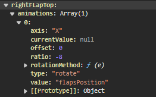

# GeoFS Developer Docs
GeoFS does not have much plugin documentation, so this is a practical beginner guide for writing your own Tampermonkey scripts.

The examples below are based on what I've learned while building the F-18 addon in this repository.

---

## 1) Your first Tampermonkey script

Use this as a safe starter template:

```js
// ==UserScript==
// @name         GeoFS My First Addon
// @namespace    https://www.geo-fs.com/
// @version      0.1.0
// @description  My first GeoFS script
// @match        https://www.geo-fs.com/*
// @match        https://geo-fs.com/*
// @match        https://*.geo-fs.com/*
// @grant        none
// @run-at       document-idle
// ==/UserScript==

(function () {
  'use strict';
  console.log('[MyAddon] Loaded');
})();
```

---

## 2) Wait for GeoFS objects to be ready

GeoFS loads a lot after page load. Do not assume objects are immediately available.

```js
const POLL_MS = 400;
const MAX_TRIES = 150;

let tries = 0;
const timer = setInterval(() => {
  tries += 1;

  const ready = Boolean(window.geofs?.aircraft?.instance && window.controls);
  if (ready) {
    clearInterval(timer);
    console.log('[MyAddon] GeoFS ready');
    return;
  }

  if (tries >= MAX_TRIES) {
    clearInterval(timer);
    console.warn('[MyAddon] GeoFS not ready in time');
  }
}, POLL_MS);
```

Tip: use optional chaining (`?.`) in addon code if the object might not be available yet.

## 3) Running logic every frame (safely)

For continuous updates, use frame callbacks or small intervals.

```js
const callbackId = geofs.api.addFrameCallback(() => {
  // Keep logic lightweight here.
});

// Later: remove callback if your script supports unload.
// geofs.api.removeFrameCallback(callbackId);
```

Best practice: keep per-frame logic minimal and cache lookups when possible.

## 4) Animating parts on your airplane.
Some basic controls can be easily adjusted via the `controls` object in GeoFS:

```
controls.airbrakes.position = 0.5 // Airbrakes out halfway.
```

But other controls (like the flaps), you can't control directly, because GeoFS constantly sets the value it needs to animate to, thus overwriting your `controls.flaps.position = 1`. Luckily you can set the target it needs to animate to, and execute the animation:

```
controls.flaps.positionTarget = 0.5; // Position 0.5 out of 2 (controls.flaps.maxPosition).
controls.setPartAnimationDelta(controls.flaps);
```

Then there are parts that are not primary flight controls, but you would like to animate. Luckily you can access all GeoFS parts of your aircraft in `geofs?.aircraft.instance.parts`. When you execute this in console, you'll see a list of parts for your aircraft.
When you open a part, you can see some have an animation tied to it:



But as GeoFS sets the values for these animations, you can't overwrite them (as they get reset every frame to the value GeoFS wants). So if you want to animate a specific part, you'll have to add your own animation to the array.

Here is a little demo script to show how to add your own animation to an aircraft part, and set it with every frame.

```
  let partName = 'tailHook'; // <-- Modify with the name of your part.
  let part = geofs?.aircraft?.instance?.parts?.[partName];

  part.animations = part.animations || [];
    part.animations.push({
      name: partName + 'RotXDeg',
      type: 'rotate',
      axis: 'X',
      value: partName + 'RotXDeg', // custom animation key
      rotationMethod: part.object3d.setRotationX.bind(part.object3d)
    });

  // Example: set the value of the airhook based on the throttle position. Silly, but just for testing ;).
  geofs.api.addFrameCallback(() => {
    const throttlePosition = controls?.throttle || 0;
    geofs.animation.setValue(partName + 'RotXDeg', throttlePosition * 270);
  });
```

Additionally, the 3D model can contain parts that the developer didnt' include in `geofs.aircraft.instance.parts` (like the Fuel probe in the F-18). But they are available in the 3D model, which you can find here `geofs?.aircraft.instance.parts['root'].object3d._children` or here `geofs?.aircraft.instance.object3d._children`. You can also access the part (called a node in CesiumJS) like this: `geofs?.aircraft.instance.object3d.model._model.getNode('Probe')`

With below script you can search for any part (even those who are not in geofs.aircraft.instance.parts), and add your custom animations to it, so you can animate anypart in any direction:

```
(() => {
  const partName = 'Probe'; // aanpassen indien nodig

  const ac = geofs.aircraft.instance;
  const model = ac.object3d.model._model;

  const findNodeNameLoose = (wanted) => {
    const tries = [wanted, wanted.toLowerCase(), wanted.toUpperCase()];
    for (const n of tries) {
      try {
        const node = model.getNode(n);
        if (node) return String(node.name || node._name || node.id || wanted);
      } catch {}
    }
    return null;
  };

  const realNodeName = findNodeNameLoose(partName);
  if (!realNodeName) throw new Error(`Node niet gevonden: ${partName}`);

  // Part ophalen of toevoegen
  let part = ac.parts?.[partName];

  if (!part) {
    const partDef = {
      name: partName,
      node: realNodeName,
      parent: 'root',
      animations: []
    };

    ac.definition.parts = Array.isArray(ac.definition.parts) ? ac.definition.parts : [];
    if (!ac.definition.parts.some(p => String(p?.name) === partName)) {
      ac.definition.parts.push(partDef);
    }

    ac.addParts([partDef], ac.aircraftRecord?.fullPath, ac.definition?.scale || 1, ac.definition?.orientation);
    part = ac.parts?.[partName];
  }

  if (!part?.object3d) throw new Error(`Part/object3d niet beschikbaar: ${partName}`);

  part.animations = Array.isArray(part.animations) ? part.animations : [];

  const addRotAnim = (axis) => {
    const animKey = `${partName}Rot${axis}Deg`;
    if (part.animations.some(a => a?.name === animKey)) return;

    const method = part.object3d[`rotate${axis}`];
    if (typeof method !== 'function') {
      console.warn(`rotate${axis} niet beschikbaar op object3d`);
      return;
    }

    part.animations.push({
      name: animKey,
      type: 'rotate',
      axis: axis,
      value: animKey,
      rotationMethod: method
    });
  };

  addRotAnim('X');
  addRotAnim('Y');
  addRotAnim('Z');

  console.log(`OK: part=${partName}, node=${realNodeName}, anims X/Y/Z added`);
})();
```

Now if your part is called 'Probe', you can animate it on the X, Y and Z axis like this:

```
geofs.animation.setValue('ProbeRotXDeg', -40);
geofs.animation.setValue('ProbeRotYDeg', 10);
geofs.animation.setValue('ProbeRotZDeg', 20);
```

## 5) HUD basics

HUD rendering can be overridden by replacing renderer functions (advanced).

From our addon, a safer strategy is:
- keep reference to original renderer
- install custom renderer only when target aircraft is active
- restore original renderer when disabling your module

This prevents breaking HUD rendering when switching aircraft.

---

## 6) Local settings (plugin options)

Use `localStorage` for persistent options and normalize keys.

```js
const STORAGE_KEY = 'MyAddonOptions';

function normalizeToken(v) {
  return String(v ?? '')
    .trim()
    .toUpperCase()
    .replace(/[^A-Z0-9]+/g, '_')
    .replace(/^_+|_+$/g, '');
}

function buildKey(page, key) {
  return `${normalizeToken(page)}.${normalizeToken(key)}`;
}
```

This keeps keys consistent and predictable.

---

## 7) Extending the F18 addon from your own script

If `window.F18Addon` is present, you can extend features without editing core code.

## 8) Checklist

Before shipping your script:

1. Guard GeoFS access with `?.` and readiness checks when the plugin is still initializing.
2. Keep intervals/frame callbacks lightweight.
3. Use clear storage keys.
4. Avoid hard crashes (`try/catch` around optional integrations).
5. Clean up anything you install (handlers, callbacks, render overrides).

---

## 9) Useful console snippets

```js
// Current aircraft id
geofs?.aircraft?.instance?.id

// All known parts
Object.keys(geofs?.aircraft?.instance?.parts || {})

// Current camera mode
geofs?.camera?.currentModeName

// Animation values (live)
geofs?.animation?.values
```

If you are new: start with one small feature (for example one button or one animated part), test it, then expand.# GeoFS Developer Docs
GeoFS lacks some documentation on how to write good plugins for it. That's why I'm sharing what I've learned here.

## 10) Changing the HUD
```
// Access the F-18 HUD (which is the genericHUD):
const hudOpts =
  geofs.aircraft.instance.definition
    .parts[87]
    .object3d
    ._parent
    ._children[83]
    ._children[0]
    ._options;

// Call this to rerender the HUD:
geofs.aircraft.instance.definition.parts[87].object3d._parent._children[83]._children[0].render()

// Example: change the position of the HUD:
geofs.aircraft.instance.definition.parts[87].object3d._parent._children[83]._children[0]._initialPosition = [100, 100, 100]
// Call render to render the change.

// Get the location of the HUD:
geofs.aircraft.instance.definition.parts[87].object3d._parent._children[83]._children[0].htr